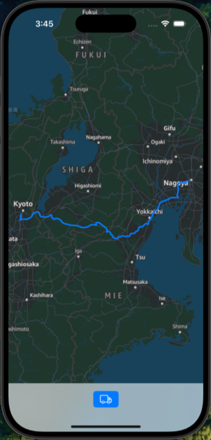

# Amazon Location Service Route Demo for iOS

[日本語の情報(for Japanese)](https://blog.msysh.me/posts/2024/12/draw-route-using-amazon-location-service-on-ios.html)

This iOS demo application showcases the integration of Amazon Location Service for calculating truck-specific routes using SwiftUI. The app demonstrates how to implement route calculations with custom truck parameters while avoiding toll roads and tunnels.

It's an extremely simple code, so it's ideal for those who are just starting to use Amazon Location Service for iOS.



## Features

- Interactive map display using MapLibre
- Truck-specific route calculation
- Custom vehicle parameters support including:
  - Axle count
  - Engine type
  - Gross weight
  - Hazardous cargo handling
  - Vehicle dimensions
  - Speed limitations
- Route avoidance options for toll roads and tunnels
- Visual route display on the map

## Prerequisites

- Xcode 15.0 or later
- iOS 15.0 or later
- AWS Account with Amazon Location Service configured
- Amazon Cognito Identity Pool

## Setup

### 1. Clone this repository

```bash
git clone https://github.com/msysh/aws-sample-location-service-route-for-ios.git
cd aws-sample-location-service-route-for-ios
```

### 2. Install dependencies:

```bash
cd cdk
npm install
```

### 3. Deploy the CDK stack:

```bash
npx cdk deploy
```

### 4. Open the iOS project in Xcode:

```bash
cd ios/AmazonLocationServiceRouteDemo
open AmazonLocationServiceRouteDemo.xcodeproj
```

### 5. Configure Info.plist

Configure following properties:

| Key | Description | Example Value |
| --- | --- | --- |
| AmazonCognitoIdentityPoolId | Cognito ID Pool's ID | `<region>:<random-value>` |
| AmazonLocationServiceApiKey	|	API Key value	| `v1.public.a1b2c3...` |
| AmazonLocationServiceMapStyle	| Map style |	`Standard`, `Monochrome` ... etc |
| AmazonLocationServiceRegion | AWS region | `us-east-1` |

### 6. Build and run the application

## Cleanup

Before `cdk destroy`, you need delete API key of Location Service following command:

```bash
aws location delete-key --key-name ${API_KEY_NAME} --force-delete
```

And then, you can delete AWS resources following command:

```bash
cd aws-sample-location-service-route-for-ios/cdk
cdk destroy
```

## Project Structure

- `/cdk` - AWS CDK infrastructure code
- `/ios` - iOS application source code

## License

Apache-2.0 license